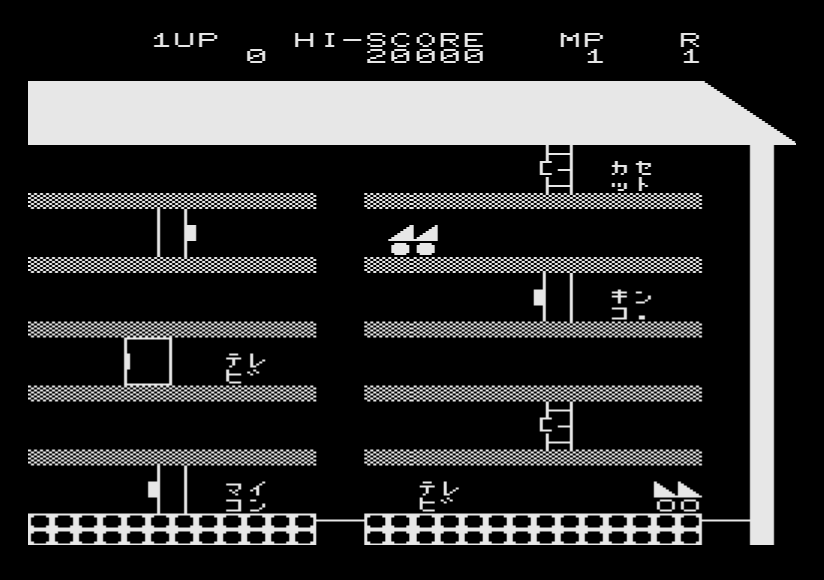
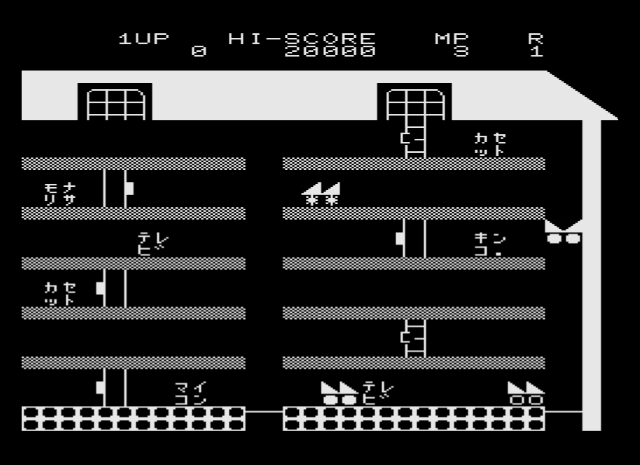
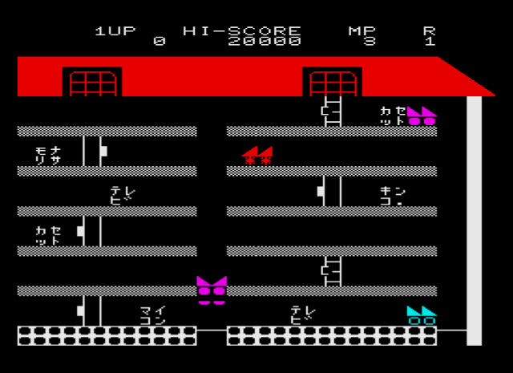
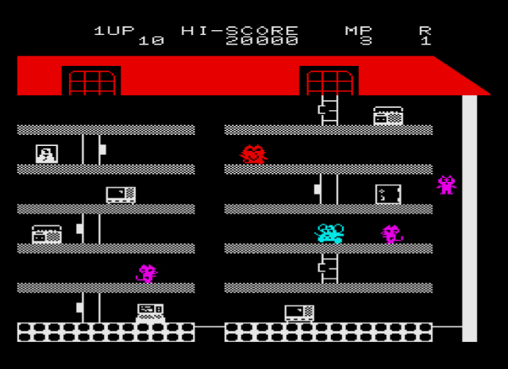

# X68K-MZMAPPY

[ Engligh | [日本語](README_ja.md) ]

<br>

## Overview

This is a port of Mappy for the MZ-80K, released by Denpa Shimbun in 1984, to the SHARP X68000.  (under construction)  
This project is an attempt to use X-BASIC to create a game in as standard an environment as possible.  
However, due to the very slow execution speed of the interpreter, a C compiler will be used to convert the BASIC program to C source, create an executable file, and execute it.  

<br>

## ScreenShots

Title  



<br>

MZ-80K Mode  



<br>

MZ-700 Mode  



<br>

MZ-700+PCG Mode  



<br>

## Startup

- Runs on X68000, Requires `OPMDRV2` or `OPMDRV3`.
- Put the following files in the `dist` directory in the same directory.
    - mzmappy.x
    - bg.dat
    - sprite.dat
    - sprite-pcg.dat
- From `COMMAND.X`, execute `mzmappy.x`.

<br>

## How to play

Joystick only.

- Directional keys: left/right movement
- Button: Door open/close, game start
- ESC key: Exit

<br>

## Compile from BASIC Source

- if using X68000 XC, do the following:

```
A:>cc mzmappy.bas
```
